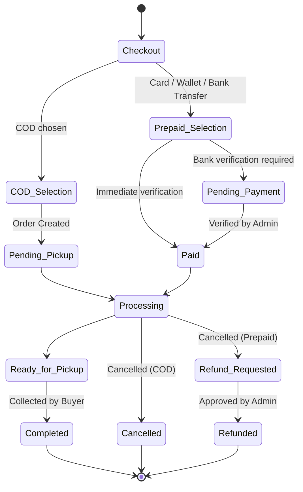
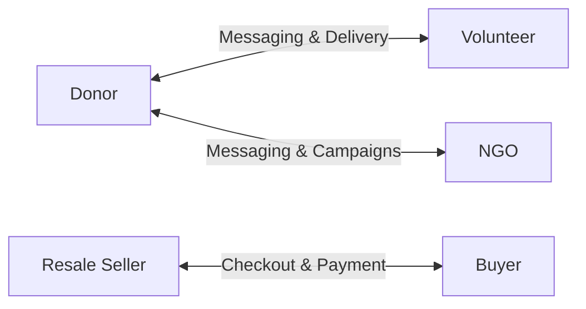

# FoodBridge 🤝 Connecting Surplus Food with Hungry Hearts

FoodBridge is a software platform designed to reduce food waste and alleviate hunger by connecting food donors, volunteers, NGOs, and buyers. It supports both **Free Food Donation** campaigns and **Food Resale (Prepaid/COD)** marketplaces, complete with role-based routing, real-time messaging, and review systems.

---

## 🏗️ Software Architecture Diagram

This project implements the **MVC (Model-View-Controller)** pattern combined with a **Repository Pattern** to separate database interactions from business logic. State management is powered by **GetX**.

GitHub natively renders diagram blocks using **Mermaid**. Below is the internal structure of the software project:

```mermaid
graph TD
    subgraph UI Layer (Views)
        MainLayout[MainLayoutScreen]
        Details[FoodPostDetailsScreen]
        Checkout[CheckoutScreen]
        MyPosts[MyPostsScreen]
        MyOrders[MyOrdersScreen]
    end

    subgraph Controller Layer (GetX)
        AuthCtrl[AuthController]
        HomeCtrl[HomeController]
        PostCtrl[CreatePostController]
        ReviewCtrl[ReviewController]
    end

    subgraph Data Access Layer
        PostRepo[PostRepository]
        StatsRepo[StatsRepository]
        AuthService[Firebase Auth]
    end

    subgraph Database Layer
        Firestore[(Cloud Firestore)]
        Storage[(Firebase Storage)]
    end

    %% Connections
    MainLayout --> HomeCtrl
    Checkout --> PostCtrl
    MyPosts --> PostCtrl
    Details --> ReviewCtrl
    
    HomeCtrl --> PostRepo
    PostCtrl --> PostRepo
    PostRepo --> Firestore
    PostRepo --> Storage
    AuthCtrl --> AuthService
```

---

## 🔀 System Flowcharts

### 1. Resale Checkout & Order Lifecycle
This diagram shows the states an order transitions through, including Cash on Delivery (COD) and prepaid channels:



### 2. User Collaboration Map
Connections and interactions between different actors in the system:



---

## 📂 Code Directory Structure

```directory
foodbridge-app/
├── android/                  # Android platform configuration
├── ios/                      # iOS platform configuration
├── firestore.rules           # Secure rules for Firestore database
├── assets/                   # Images and localization dictionaries
├── lib/
│   ├── main.dart             # Application startup point
│   ├── controllers/          # GetX controllers (logic & state)
│   │   ├── auth_controller.dart
│   │   ├── home_controller.dart
│   │   └── create_post_controller.dart
│   ├── models/               # Data structures mapped to Firestore docs
│   │   ├── food_post_model.dart
│   │   ├── order_model.dart
│   │   ├── payment_model.dart
│   │   └── refund_model.dart
│   ├── data/                 # Repositories for Firebase queries
│   │   ├── post_repository.dart
│   │   └── stats_repository.dart
│   ├── utils/                # Design system styling templates
│   │   └── theme/
│   │       ├── colors.dart
│   │       └── typography.dart
│   └── views/                # Presentation layer (Screens & Widgets)
│       ├── screens/
│       │   ├── auth/         # Login, Sign Up, & Onboarding
│       │   ├── admin/        # Admin analytics, reports & refunds
│       │   └── user/         # Marketplace checkout, posts & profile
│       └── widgets/          # Reusable shared UI cards & fields
```

---

## ⚙️ Design Decisions: Reusability & Compatibility

### 1. High Component Reusability
- **Custom UI Components**: Widgets like `EmptyStateWidget`, `AppCard`, `CustomBWButton`, and `StarRatingWidget` are parameterized and shared across all modules (Donations, Resales, Admin panels) to maintain uniform aesthetics.
- **Repository Pattern**: All Firestore reads/writes are contained in `PostRepository` and `StatsRepository`, making the presentation layer clean and independent of database API shifts.

### 2. Firestore Query Compatibility (Zero Index Configuration)
- The system queries orders and posts using direct `.where()` queries and sorts arrays **in-memory** in Dart:
  ```dart
  final snapshot = await FirebaseFirestore.instance
      .collection('orders')
      .where('buyerId', isEqualTo: buyerId)
      .get();
  orders.sort((a, b) => b.createdAt.compareTo(a.createdAt));
  ```
- This avoids needing compound indexes configured on Firebase, making the system work out-of-the-box on new environments.

---

## 📱 Hardware & Platform Compatibility

| Platform | Minimum Version | Target Version | Recommended Settings |
| :--- | :--- | :--- | :--- |
| **Android** | API Level 21 (Lollipop) | API Level 34 (Android 14) | Multidex enabled |
| **iOS** | iOS 12.0 | iOS 17.0 | Location permissions defined in `Info.plist` |
| **Flutter** | SDK `>=3.0.0` | Latest Stable | Dart Sound Null Safety enabled |

---

## 🚀 Getting Started

### 1. Setup Environment
Ensure Flutter is installed. Run:
```bash
flutter doctor
```

### 2. Configure Firebase
1. Create a Firebase project.
2. Add Android/iOS applications to the console and place configuration files (`google-services.json` and `GoogleService-Info.plist`) in respective directories.
3. Enable Email/Password authentication in Firebase Console.
4. Deploy the rules file:
   ```bash
   firebase deploy --only firestore:rules
   ```

### 3. Run the App
```bash
flutter pub get
flutter run
```
